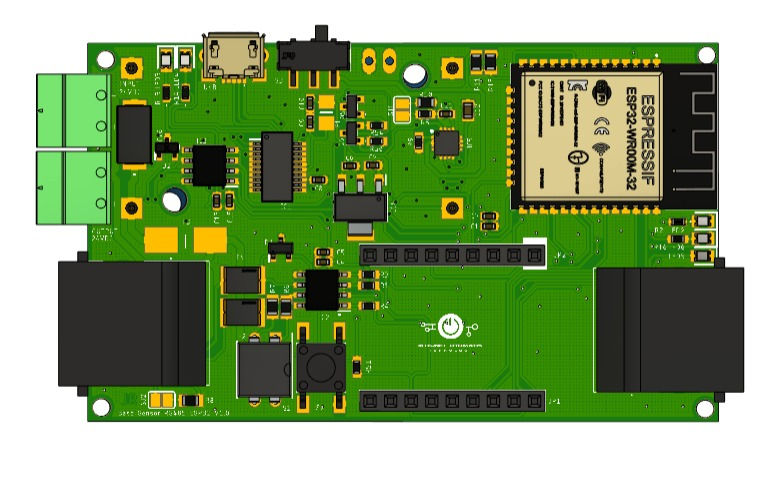
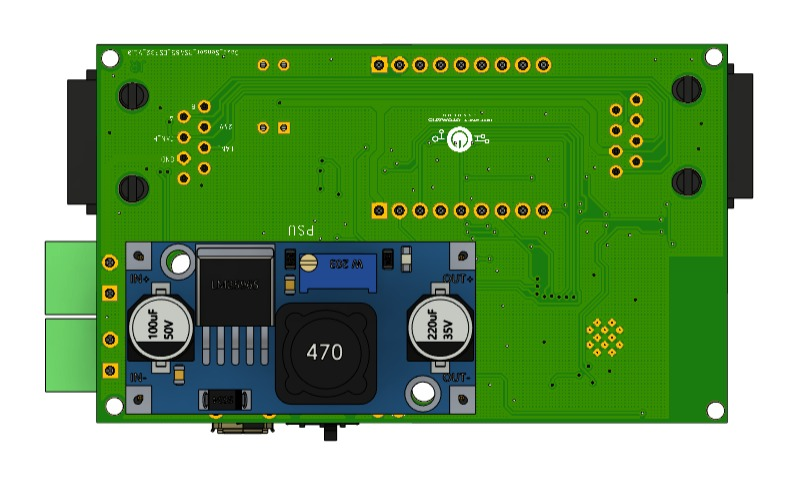
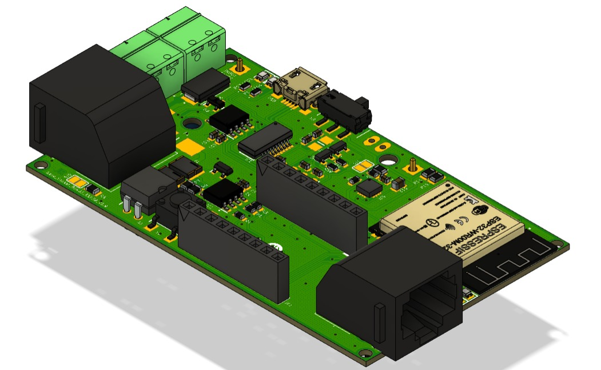
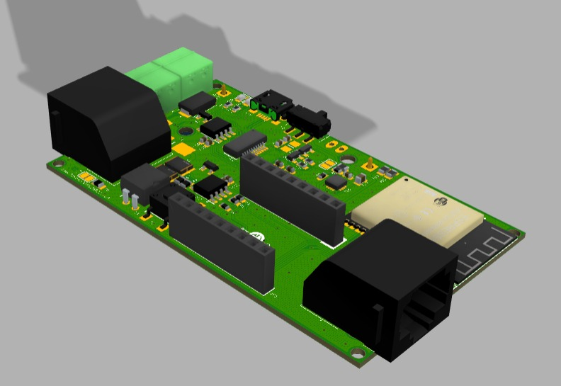
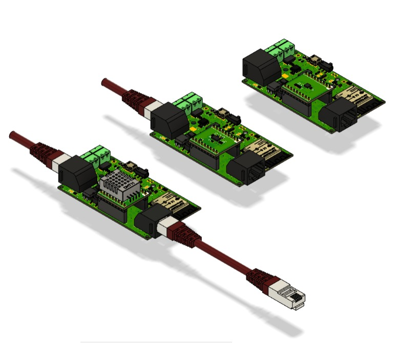
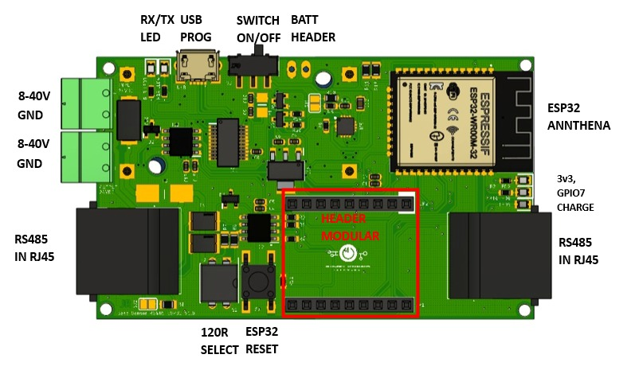
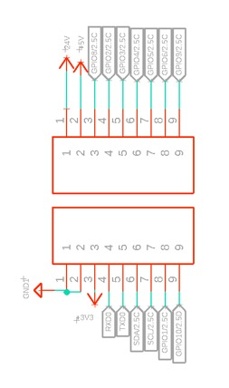

# Modular-Sensor-ESP32-RS485

## Spesification
- ESP32 as Microcontoller
- RS485 with 3v3 Supply
- CANBUS
- 8V-40V Input Voltage LM296

## Preview Web UI

  
  
  
  
  
  

## Preview Hardware

  
  
  
  
  

## Pinout
### Pinout Base

  

### Pinout Modular

  

